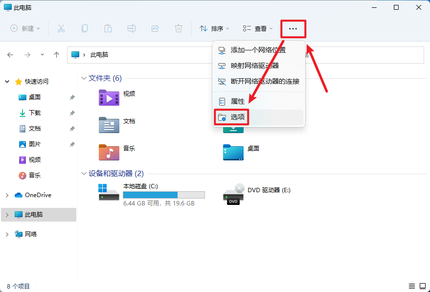
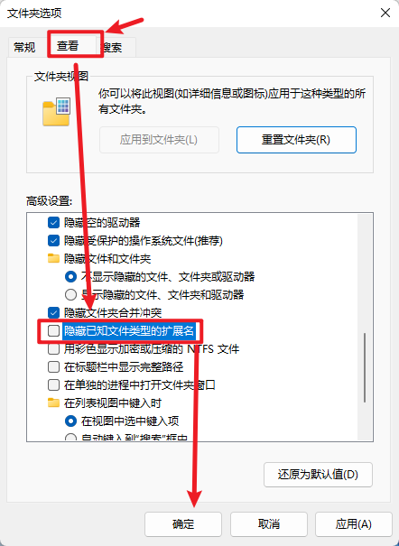
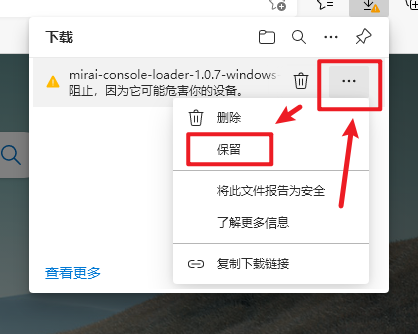
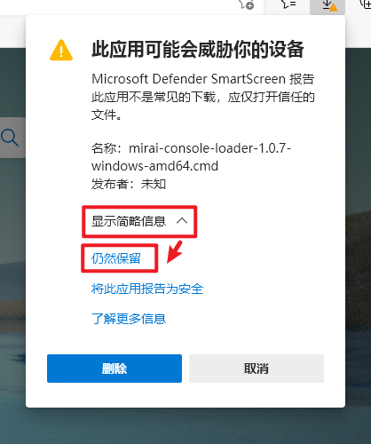
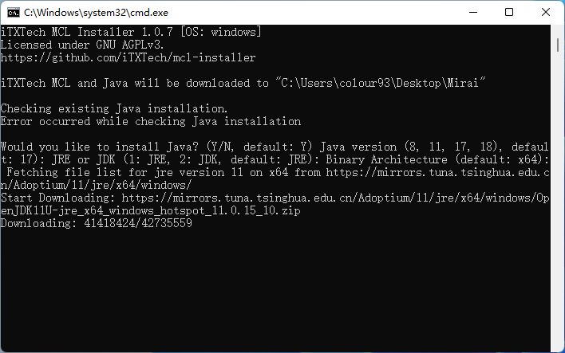
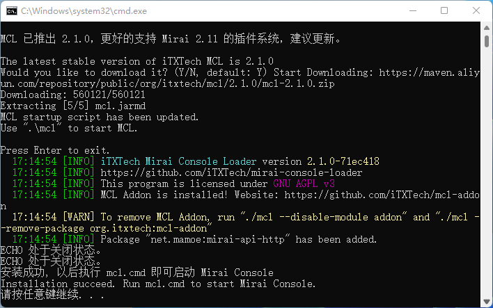
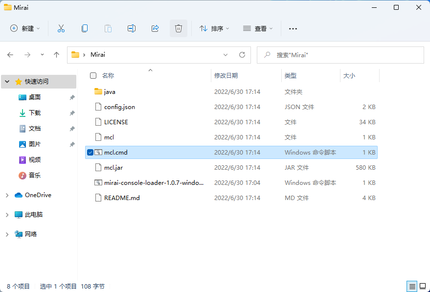
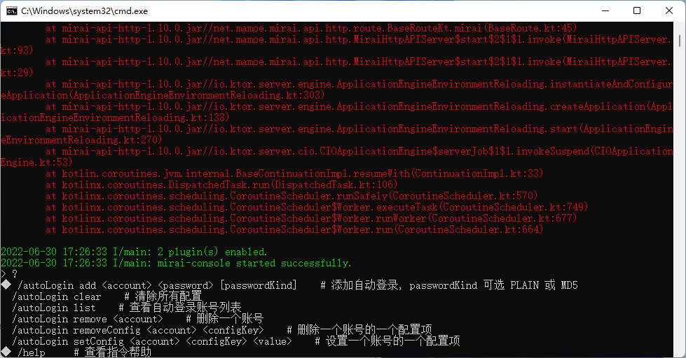

# 部署 Mirai Console Terminal

!> 请注意，您在本教程任何地方输入命令时，都应保持输入法为**英文**（半角）状态，这很重要！

## [官方文档][官方文档]

推荐**有计算机基础的用户（如自己部署过 Minecraft 的服务器）**阅读[**官方文档**][官方文档]，官方文档更加严谨详实，这里的下文主要面向计算机小白。

## Windows

> 纯小白推荐**使用脚本安装**。

### 一切开始之前

请先确保系统已经可以**显示文件拓展名**（这是个巨坑），教程如下：

### 使用脚本安装

这里可以使用改自官方文档的安装脚本安装（使用FastGit以确保连接稳定性，更新mcl版本至 x64 1.0.7），[脚本下载][Windows 安装脚本]。

下载后的脚本可能提示**“危害你的设备”**，请参照如下操作：

脚本下载好后，请将其移动至您想要存放机器人的位置（建议是一个**空文件夹**），而后只需要双击运行，耐心等待安装（该过程视您的网络环境而定）。

安装中的界面：

安装完成后：

安装完毕后，按照提示，打开 `mcl.cmd` 。

出现下图的 `>` 并闪光标时，输入 `?` 并回车，如果出现帮助列表，说明安装成功~

接下来您可以前往下一部分了👉 [登录 Bot 账号](/deployMirai/login)

!> 请注意，您在本教程任何地方输入命令时，都应保持输入法为**英文**（半角）状态，这很重要！

## macOS

## Linux

> 我相信使用 Linux 的用户应该可以把官方文档看懂（bushi

[官方文档]: https://docs.mirai.mamoe.net/ConsoleTerminal.html
[Windows 安装脚本]: https://yinlan-bot.oss-cn-beijing.aliyuncs.com/livebot/guide/mirai-console-loader-1.0.7-windows-amd64.cmd