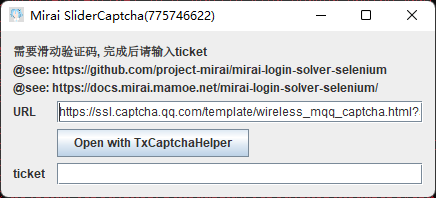
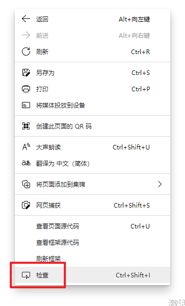
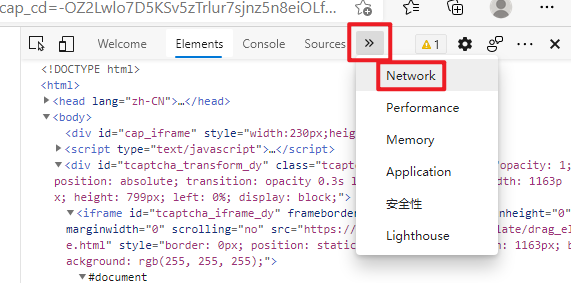
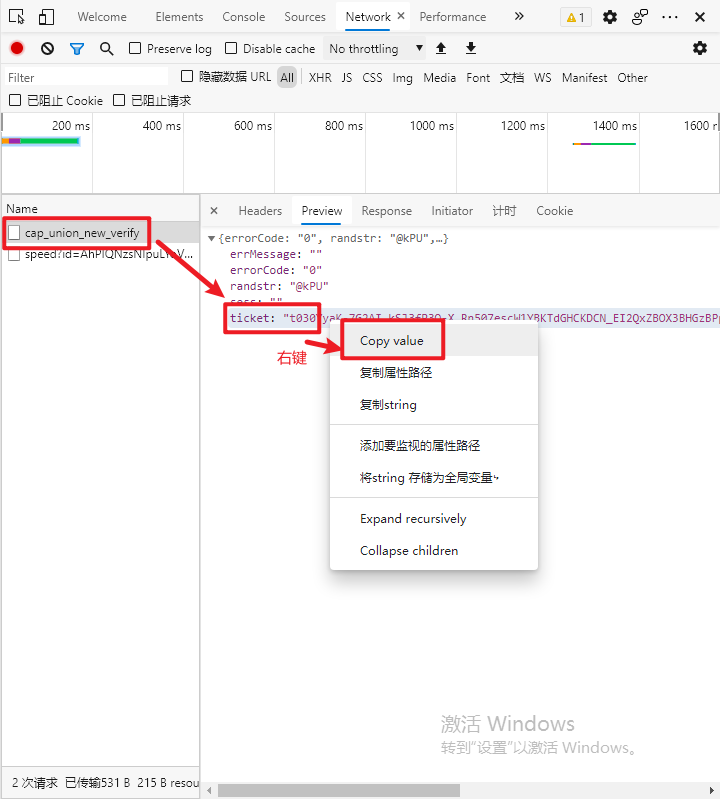
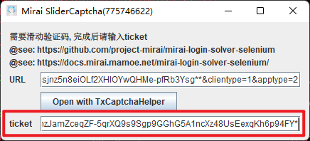
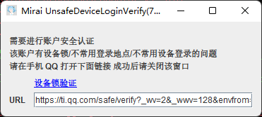
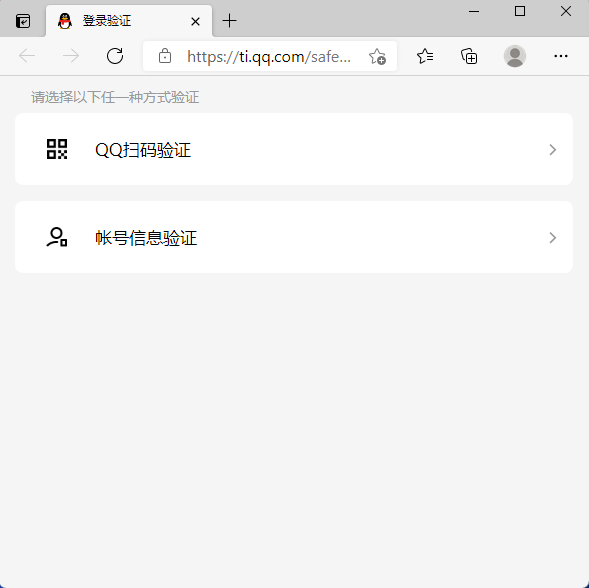
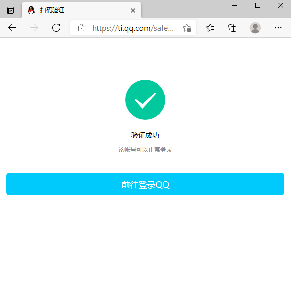
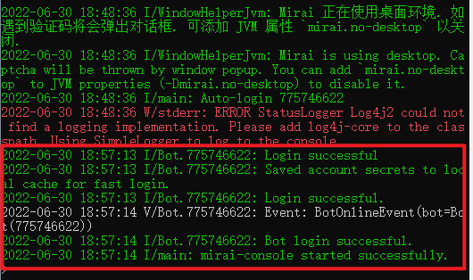

# 登陆 Bot 账号

!> 本人并不推荐使用自己平时常用的 QQ 账号作为 Bot 账号使用，作为 Bot 账号将占用 Android 端 QQ，并且 Bot 有被腾讯封号的风险。

在已经启动的 Mirai Console Terminal 中输入 `/autologin add <账号> <密码>` 如图所示：

> 如果有能力，推荐使用 `?` 查看帮助后，遵照帮助使用 md5 后的密码进行登录。

显示 `已成功添加 'xxxxxxxx'.` 后，输入 `/login <账号>` 进入登录流程。

## 滑动验证码

> Windows 用户的验证码 `URL` 是以弹窗的形式展现，而 macOS / Linux 用户则是藏在命令行之中，本质上没有区别。

全选 `URL` 中的网址，复制到浏览器中打开。打开后右键页面，选择 `检查` （如果没有请尝试使用 `F12` 、 `Ctrl + Shift + I`）。

点击 `Network` 或 `网络` 选项卡。

然后完成验证码的滑动验证。完成后，在 `Network` 或 `网络` 选项卡中找到 `cap_union_new_verify`，左键选中，然后右键显示出的 `ticket` 字段，点击 `Copy value`（复制值）。

将复制好的 `ticket` 粘贴到窗口对应的 `ticket` 中，回车即可。

> macOS / Linux 用户只需要把 `ticket` 粘贴回终端，回车即可。

## 设备锁

> Windows 用户的 `URL` 是以弹窗的形式展现，而 macOS / Linux 用户则是藏在命令行之中，本质上没有区别。

点击 `设备锁验证` 或全选 `URL` 中的网址，复制到浏览器中打开。

进行验证。

> 推荐使用 QQ 扫码

完成后如图所示：

回到窗口，将其关闭即可。

> macOS / Linux 用户只需要回到终端，回车即可。

## 登录成功

登录成功后长这样：

