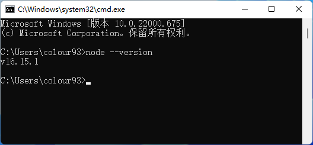

# 配置 node-gyp

?> 数据库（better-sqlite3）使用 node-gyp，以至于我们需要用到 Python & Visual Studio Build Tools

## Python 3.10 安装

有别于 Node.js，Python 官网需要科学上网或是用迅雷才能保证正常的下载速度，所以这里我将安装包上传至了下面云盘，有能力优先官网下载，大家按需所取即可 👉 [蓝奏云](http://py.furrrrrrrrry.icu) | [python.org](https://www.python.org/downloads//)

然后一路下一步（安装路径根据您的喜好选择），安装完之后按 `Win` + `R` 键，输入 `cmd` 并回车，输入 `node --version`，如果显示版本信息，则为安装成功~

如果您安装成功，那么恭喜您，接下来您可以前往一下部分了🎉 👉 [运行并配置洇岚](/deployYinlan/deployYinlan)

## Visual Studio Build Tools 安装

