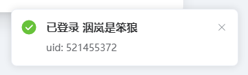
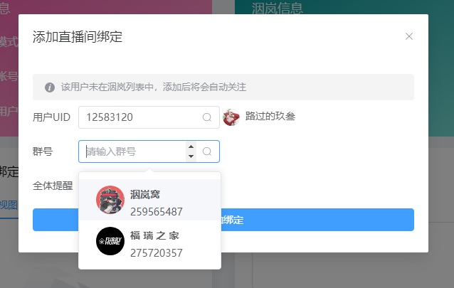

# 运行并配置洇岚

## 下载洇岚主程序

首先需要下载洇岚主程序，推荐在 GitHub 下，不过鉴于有些小伙伴科学上网困难，这里提供两个其他下载地址，点击图中位置即可下载。 👉 [GitHub (推荐)](https://github.com/colour93/yinlan-livebot/releases) | [FastGit (推荐)](https://hub.fastgit.xyz/colour93/yinlan-livebot/releases) | [洇岚OSS (beta-v0.1.0)](https://yinlan-bot.oss-cn-beijing.aliyuncs.com/livebot/version/0.1.0-fixed-1/yinlan-livebot-0.1.0-fixed-1.zip)

下载完毕后请找个空文件夹进行解压缩，下面是一会儿要用到的文件。

## 安装环境依赖

只需要双击 `install.cmd` （macOS / Linux 用户请使用终端运行 `install.sh`），等待其运行完毕即可~

> 这里可能会因为网络原因失败几次，没关系多试几次就好了。

## 运行主程序

双击打开 `start.cmd` （macOS / Linux 用户请使用终端运行 `start.sh`），如果输出信息为下图所示，那便是成功啦~

## 初始化配置

!> 初始化之前，请先确保您要使用 Bot 的 QQ 账号上包含 **一个管理 Bot 使用群聊**、**一个 Bot 主人的好友**！

根据提示可以看到**面板地址**，一般默认面板地址为 `http://localhost:21050` （请本地访问）。

> 该页面设计参考 Tailwind CSS Playground 中的 demo。

点击按钮继续后，请在 `Bot QQ` 栏，填入您使用 Bot 的 QQ，然后将**上一大章（部署 Mirai Console Terminal）**中的 `config` > `net.mamoe.mirai-api-http` > `setting.yml` 文件拖拽至文件检测区域，
自动完成其他项目的填写（当然您也可以手动填写），填写完毕后请点击按钮。

您可以在该页面设置 **Bot 名称**、**管理 Bot 使用群聊**、**Bot 主人**，以及对 **好友**、**群聊** 的添加或邀请申请。

当您设置完全部选项后，将会提示您配置完毕，此时洇岚主程序会自动退出，需要您手动再次开启（即再次 `start`）。

开启后浏览器将自动跳转至登录页面，同时，您的管理群聊中应当接收到了上线提醒~

在登录页面输入您绑定的主人的 QQ，然后点击第二个输入框获取验证码，验证码将以 QQ 私聊的方式发送至您的 QQ，有效期五分钟。

## 登录您的B站账户 (推荐) [可选]

?> 登录账户后的*优点*是直播检测间隔更短，原理好似**您逐个去看关注的主播直播间是否在直播（匿名检测）**和**您在动态列表刷新查看主播是否在直播（登录检测）**；*缺点*是目前不能检测自己，因此十分**建议您使用小号登录**。

> 所有数据将本地存放！开发者不会以任何理由在用户不知情的情况下收集任何用户**隐私**信息，尤其是这类身份凭证。源码全部开放，当前版本在使用过程中仅会使用 GET 请求向 洇岚 的版本信息OSS服务器请求数据。

首先，找到 **直播检测选项** 中的 **工作模式**，将其改为 **登录账号**，然后别急着登入，先点击应用。

修改成功后，窗口右下角会显示如下提示，此时再去登入。

登入方法是使用B站移动端扫描二维码，登录凭据将存储在本地数据库中。

## 绑定主播与群聊

?> 当您已经绑定过一个主播后，该主播将会出现在智能候选框中哦~

> 如果您使用 **登录检测** 工作模式，该被绑定用户将被添加到您的关注列表中。

只需在 **直播间绑定列表** 卡片右上方，点击添加按钮，输入对应 UID 与 群号，选择是否 **at全体提醒** 后点击添加绑定即可。

## 结语

至此，您已经可以开始愉快地使用啦~ 更多功能请您暂时先自行探索嗷，开发者也在努力编写文档~ 感谢支持！