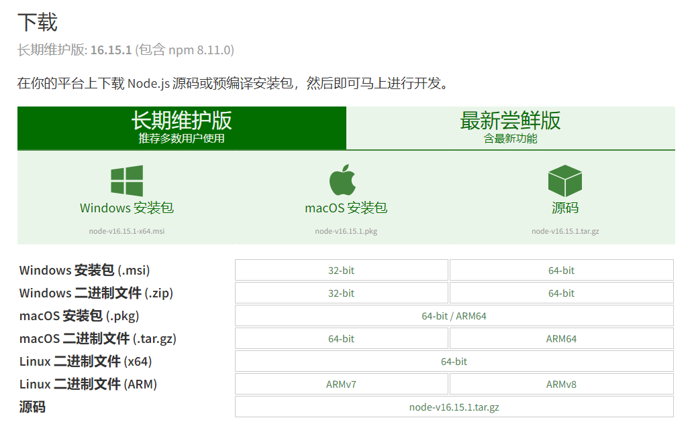
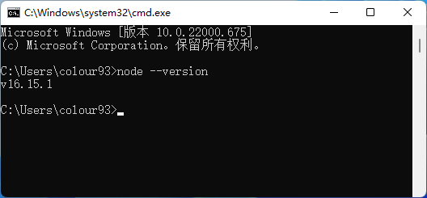

# 安装 Node.js

?> 洇岚的开发环境为 v16.13.0 ，请尽量保持版本一致或更高（使用了高版本特性）

学习过前端以及用过 Node 开发程序的小伙伴相信对此并不陌生，只要使用 **v16** 及以上版本就可以运行啦，依赖中含有 **node-gyp** ，因此还需要 Python 环境，其他完全可以跳过这一节~（如果使用 yarn 等非 npm 包管理器，记得修改 package.json 中的 scripts）

## 下载

首先打开它的官网 👉[nodejs.org](https://nodejs.org/zh-cn/download/)

然后根据您的操作系统来选择合适的进行下载（一般 Windows 用户请选择 “**Windows 安装包**”， macOS 用户选择 “**macOS 安装包**”即可）。

## 安装

然后一路下一步（安装路径根据您的喜好选择），**Windows 用户**安装完之后按 `Win` + `R` 键，输入 `cmd` 并回车，**macOS / Linux 用户**打开终端，输入 `node --version`，如果显示版本信息，则为安装成功~

如果您安装成功，那么恭喜您，接下来您可以前往一下部分了🎉 👉 [运行并配置洇岚](/deployYinlan/deployYinlan)